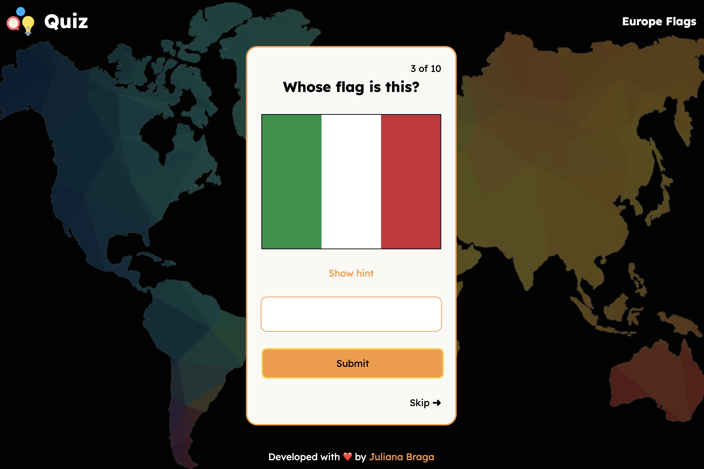

# 🇫🇷 Quiz Flags Game 🇵🇹

<p align="center">
  
</p>

<p align="center">
  <a href="https://jujbraga.github.io/quiz-flags-game/">
    
  </a>
</p>

## 💻 About the Project

This is a dynamic and educational **Quiz Flags Game** designed to test and improve your knowledge of world geography. Users are presented with flags and must write the correct country.

The project focuses on creating a fast, interactive web experience using **Vanilla JavaScript**, featuring a clean user interface and responsive design to ensure playability across all devices.

---

## ✨ Features

- **Difficulty Levels:** Choose your challenge level before starting.
- **Score System:** See your correct and incorrect answers in the end.
- **Progressive UI:** Visual feedback for correct and wrong answers.
- **Restart Functionality:** Easily reset the game to beat your high score.
- **Fully Responsive:** Optimized for desktop, tablets, and smartphones.

---

## 🛠️ Technologies Used

The project was developed using the following technologies:

- **HTML5:** Structured content for the quiz interface.
- **CSS3:** Custom styles, layout positioning, and responsive media queries.
- **JavaScript (ES6+):** Quiz logic, array shuffling, score tracking, and dynamic DOM updates.

---

## 🚀 How to Run the Project

1. **Clone the repository:**
   ```bash
   git clone [https://github.com/Jujbraga/quiz-flags-game.git](https://github.com/Jujbraga/quiz-flags-game.git)

2. **Navigate to the project folder:**
    ```bash
    cd quiz-flags-game
    ```

3. **Open the game:** Open the index.html file in your preferred web browser.

---

## 🎮 How to Play

1. Select your preferred Difficulty Level to start the quiz.

2. Observe the flag displayed at the top.

3. Write the country name and submit (the game support answers in english, portuguese-BR and swedish).

4. See if you answered right.

5. Complete all questions to see your final result!

<p align="center"> Developed with ❤️ by <a href="https://www.google.com/search?q=https://github.com/Jujbraga">Juliana Braga</a> </p>
